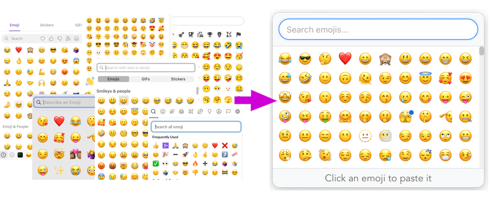
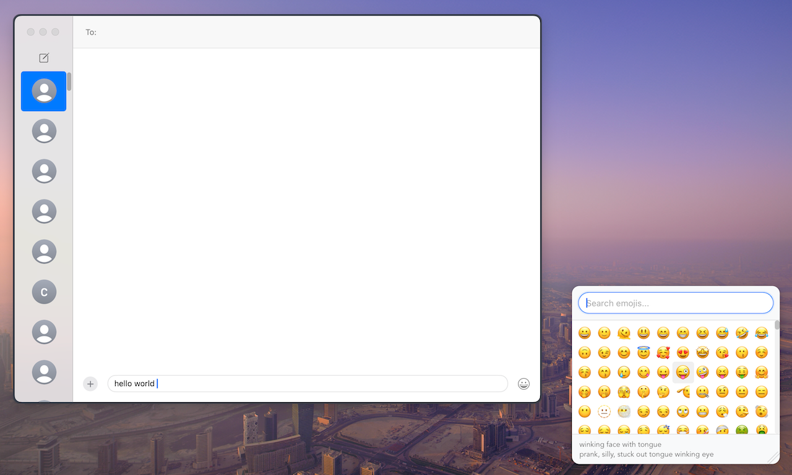

# EmojiQ

Frustrated with every app reinventing its own emoji picker? Replace them with EmojiQ.



EmojiQ provides a floating panel with instant access to emojis through a global hotkey, featuring smart search, keyboard navigation, and seamless pasting.



Inspired by the excellent [qmoji](https://github.com/jaredly/qmoji) by Jared Forsyth.

## Features

- 🚀 **Instant access**: Open with customizable global hotkey (default: `Cmd+Option+Space`)
- 🔥 **Favorite emojis**: Configurable number of most-used emojis appear first for quick access (default: 10)
- 🔍 **Fast search**: Find emojis by name, description, or keywords
- ⌨️ **Keyboard navigation**: Navigate with arrow keys; select with Enter/Space
- 📋 **Auto-paste**: Selected emojis are automatically pasted into your active application. Or copied to clipboard. Or both 🙂
- 🎯 **Smart positioning**: Optional panel positioning under mouse cursor
- ⚙️ **Customizable**: Settings for hotkey, UI scale, emoji modes, and more
- 🎨 **Native design**: Built with the cross-platform [Tauri](https://tauri.app) framework
- 📦 **Small footprint**: Low resource usage, thanks to Rust!


## Installation

```bash
brew tap rgeraskin/homebrew
brew install --cask emojiq
```

**Note**: Accessibility permissions are only required if you use "Paste" or "Paste and copy" modes. If you only want to copy emojis to clipboard, you can use "Copy only" mode in settings without granting accessibility permissions.

For paste modes, on first use, click "Open System Settings" in the dialog and enable "EmojiQ" in the list. You can grant or revoke this permission anytime in System Settings → Privacy & Security → Accessibility.

## Usage

1. **Open the picker**: Press Cmd+Option+Space (or your custom hotkey)
1. **Search**: Type to filter emojis by name or keywords
1. **Navigate**: Use arrow keys to move between emojis
1. **Hover**: Hover over an emoji to see its name and keywords
1. **Select**: Click an emoji or press Enter/Space to paste/copy it
1. **Remove from favorites**: Cmd+Click an emoji to remove it from most used
1. **Settings**: Click the tray icon and select "Settings" or press Cmd+, in the main panel
1. **Close**: Press Escape or click outside the panel

### Keyboard Shortcuts

- Cmd+Option+Space: Open/close the emoji panel (customizable)
- ↑ ↓ ← →: Navigate between emojis
- Enter or Space: Select emoji
- Cmd+Click: Remove emoji from most used list
- Cmd+,: Open settings (from main panel)
- Escape: Close the panel
- Home/End: Jump to first/last emoji
- Any character: Start typing to search

## Comparison with [qmoji](https://github.com/jaredly/qmoji)

It’s like qmoji, but with:
- keyboard navigation
- better focus management
- toggle the app with the same hotkey
- clear favorites logic: the more you use an emoji, the higher it appears
- more emojis and more keywords
- cross-platform by design (macOS supported today)
- MIT licensed
- alive and maintained :)

## Settings

Access settings via the tray icon menu or by pressing Cmd+, in the main panel:

- **Global Hotkey**: Customize the keyboard shortcut to open the emoji panel
- **Place under mouse**: Toggle whether the panel appears under your cursor. Or position it manually.
- **Most used emojis count**: Configure how many frequently used emojis appear first (0-50)
- **UI Scale Factor**: Adjust the size of all UI elements (50%-200%)
- **Emoji selection mode**: Choose between:
  - Paste only (requires accessibility permission)
  - Copy only (no accessibility permission needed)
  - Paste and copy (requires accessibility permission)
- **Reset emoji ranks**: Clear all usage statistics

Settings and emoji usage statistics are stored in `~/Library/Application Support/dev.rgeraskin.emojiq/`.

## Roadmap

Someday I might add:

- [ ] Linux support
- [ ] Windows support

Suggest a feature [here](https://github.com/rgeraskin/emojiq/issues/new)!

## Technical Details

### Architecture

- **Frontend**: Vanilla JavaScript with HTML/CSS
- **Backend**: Rust
- **UI Framework**: Cross-platform [Tauri](https://tauri.app) framework
- **Data**: JSON-based emoji database with metadata

## Development

### Building from Source

See tauri prerequisites [here](https://tauri.app/start/prerequisites/): Node.js, pnpm, and Rust toolchain.

1. Clone the repository:
   ```bash
   git clone https://github.com/yourusername/emojiq.git
   cd emojiq
   ```

2. Install dependencies:
   ```bash
   pnpm install
   ```

3. Build and run (development):
   ```bash
   pnpm tauri dev
   ```

4. Build for production:
   ```bash
   pnpm tauri build
   ```

### Project Structure

```
emojiq/
├── src/                    # Frontend (HTML/CSS/JS)
│   ├── index.html
│   ├── main.js
│   ├── main.css
│   ├── settings.html
│   ├── settings.js
│   └── settings.css
├── src-tauri/              # Backend (Rust)
│   ├── src/
│   │   ├── main.rs
│   │   ├── lib.rs
│   │   ├── emoji_manager.rs
│   │   ├── panel.rs
│   │   ├── tray.rs
│   │   ├── settings.rs
│   │   ├── hotkey.rs
│   │   └── ...
│   ├── Cargo.toml
│   └── tauri.conf.json
└── package.json
```

### Contributing

Contributions are welcome!

1. Fork the repository
2. Create a feature branch
3. Make your changes
4. Add tests if applicable
5. Submit a pull request

## License

This project is licensed under the MIT License - see the LICENSE file for details.
